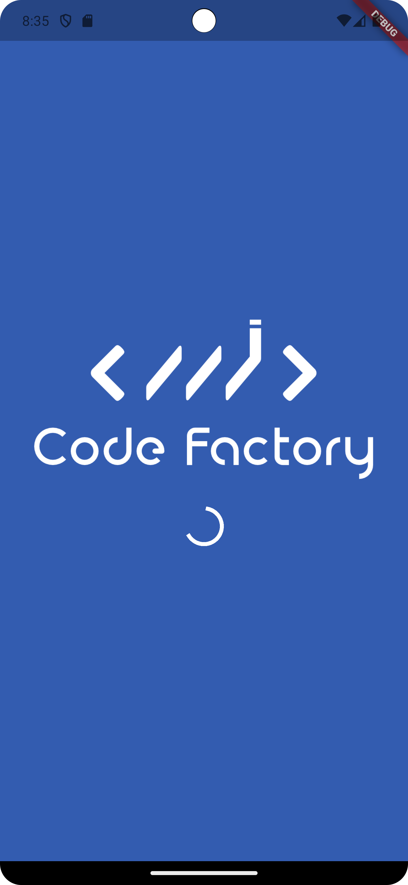

# splash_screen

**스플래시 스크린이란?**
- 앱을 처음 시작할 때 대기해야 되는 시간 동안 보여주는 스크린 
- 앱을 실행하기 위해 준비하는 코드들을 실행하는 동안 사용자한테 지금 앱이 멈춘 게 아니고 무언가 작업을 하고 있다는 걸 보여주기 위해서 사용

 

**스플래시 스크린이 보여지는동안 할 수 있는 작업**
- 지금 로그인되어 있는 사용자 검증
- 어떤 화면을 보여줄 지 정하는 로직 실행

 

  

## 프로젝트 목표
- StatelessWidget 사용법
- Asset 이미지 등록법
- Image 위젯 사용법
- Column 위젯 사용법
- HexCode 색상 사용
- CircularProgressIndicator 위젯 사용법
- Padding 위젯 사용법
- SizedBox 위젯 사용법