# row_and_column
- Flutter로 앱을 제작할 때 가장 많이 쓰이는 위젯들이다.
- 여러 개의 위젯들을 자식으로 입력할 수 있다.(children)
- Row : 가로 배치 / Column : 세로 배치

<br/><br/>

## MainAxisAlignment
- 주축 (Row : 가로 / Column : 세로)
- 제한 사항이 없다면 최대 크기를 차지

|옵션|설명|
|---|---|
| `MainAxisAlignment.start` | 주축의 시작에 정렬한다. (기본값) |
| `MainAxisAlignment.end` | 주축의 끝에 정렬한다. |
| `MainAxisAlignment.center` | 주축의 중앙에 정렬한다. |
| `MainAxisAlignment.spaceBetween` | 주축에서 위젯들 사이에 동일한 간격을 두고 정렬한다. |
| `MainAxisAlignment.spaceAround` | 주축에서 위젯들 주변에 동일한 간격을 두고 정렬한다. |
| `MainAxisAlignment.spaceEvenly` | 주축에서 위젯들 앞뒤 및 사이에 동일한 간격을 두고 정렬한다. |

<br/>

**Column**
```dart
return Scaffold(
	body: SafeArea(
	  child: Container(
	    color: Colors.grey,
	    child: Column(
	      mainAxisAlignment: MainAxisAlignment.start,
	      // ...
```


<div style="display: flex; width: 80%; justify-content: space-between;">
  <figure style="flex: 1; padding: 5px; margin: 0; text-align: center;">
    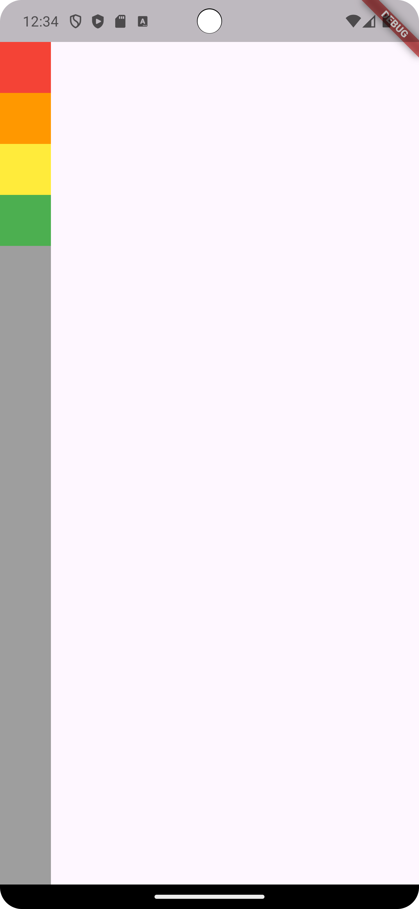
    <figcaption>MainAxisAlignment.start(기본값)</figcaption>
  </figure>
  <figure style="flex: 1; padding: 5px; margin: 0; text-align: center;">
    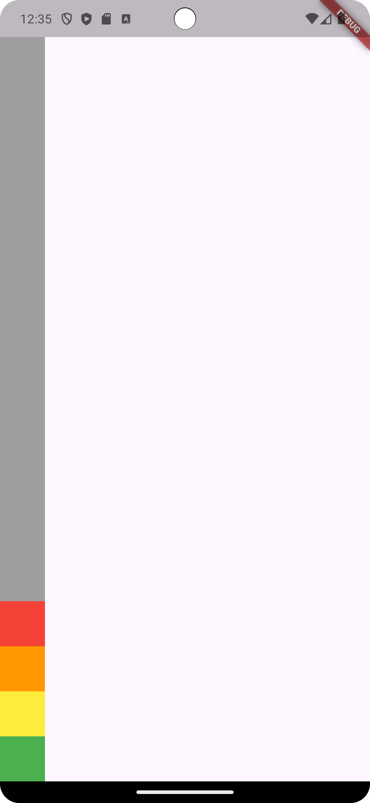
    <figcaption>MainAxisAlignment.end</figcaption>
  </figure>
  <figure style="flex: 1; padding: 5px; margin: 0; text-align: center;">
    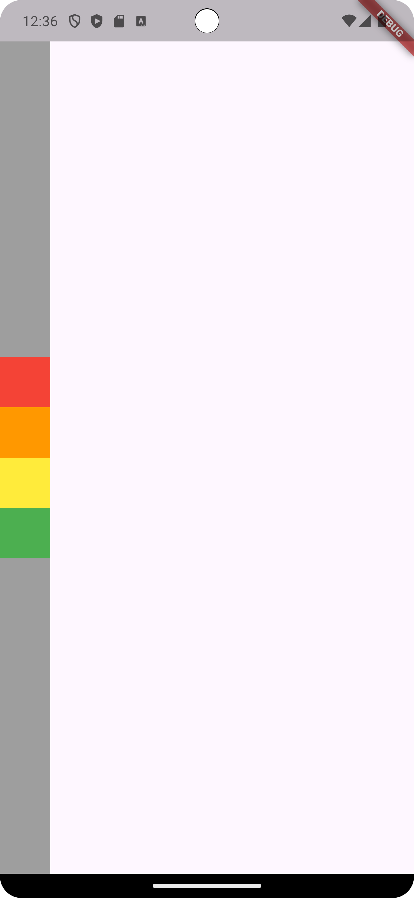
    <figcaption>MainAxisAlignment.center</figcaption>
  </figure>
</div>
<div style="display: flex; width: 80%; justify-content: space-between;">
  <figure style="flex: 1; padding: 5px; margin: 0; text-align: center;">
    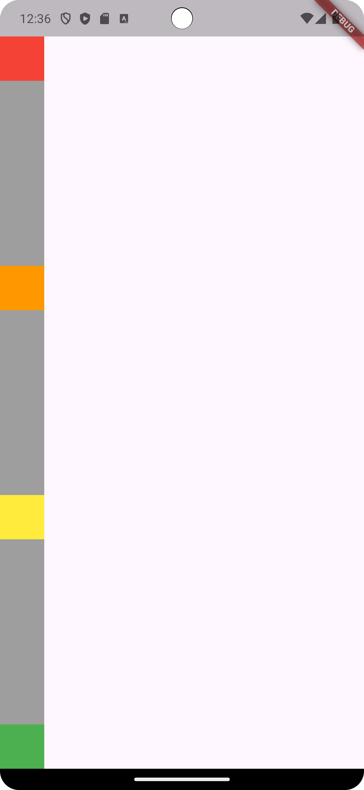
    <figcaption>MainAxisAlignment.spaceBetween</figcaption>
  </figure>
  <figure style="flex: 1; padding: 5px; margin: 0; text-align: center;">
    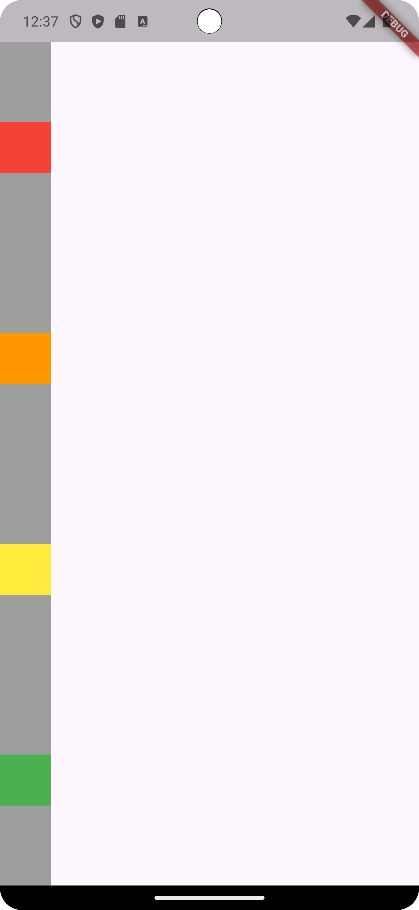
    <figcaption>MainAxisAlignment.spaceAround</figcaption>
  </figure>
  <figure style="flex: 1; padding: 5px; margin: 0; text-align: center;">
    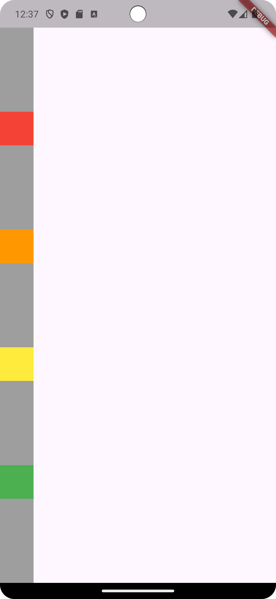
    <figcaption>MainAxisAlignment.spaceEvenly</figcaption>
  </figure>
</div>


<br/>

**Row**
```dart
return Scaffold(
	body: SafeArea(
	  child: Container(
	    color: Colors.grey,
	    child: Row(
	      mainAxisAlignment: MainAxisAlignment.start,
	      // ...
```


<div style="display: flex; width: 80%; justify-content: space-between;">
  <figure style="flex: 1; padding: 5px; margin: 0; text-align: center;">
    
    <figcaption>MainAxisAlignment.start(기본값)</figcaption>
  </figure>
  <figure style="flex: 1; padding: 5px; margin: 0; text-align: center;">
    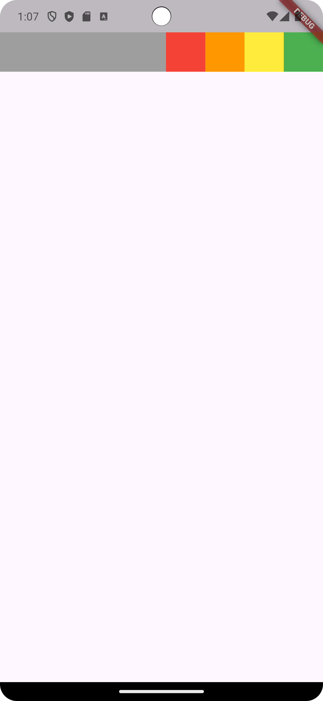
    <figcaption>MainAxisAlignment.end</figcaption>
  </figure>
  <figure style="flex: 1; padding: 5px; margin: 0; text-align: center;">
    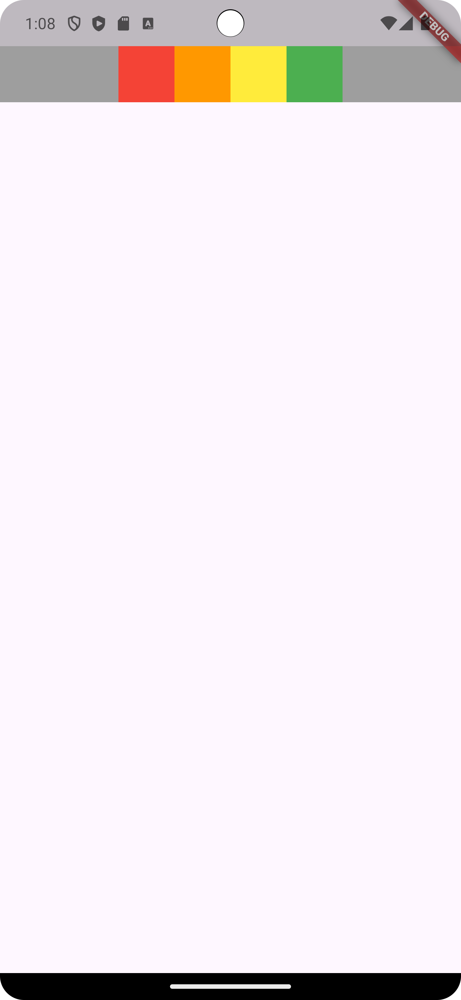
    <figcaption>MainAxisAlignment.center</figcaption>
  </figure>
</div>
<div style="display: flex; width: 80%; justify-content: space-between;">
  <figure style="flex: 1; padding: 5px; margin: 0; text-align: center;">
    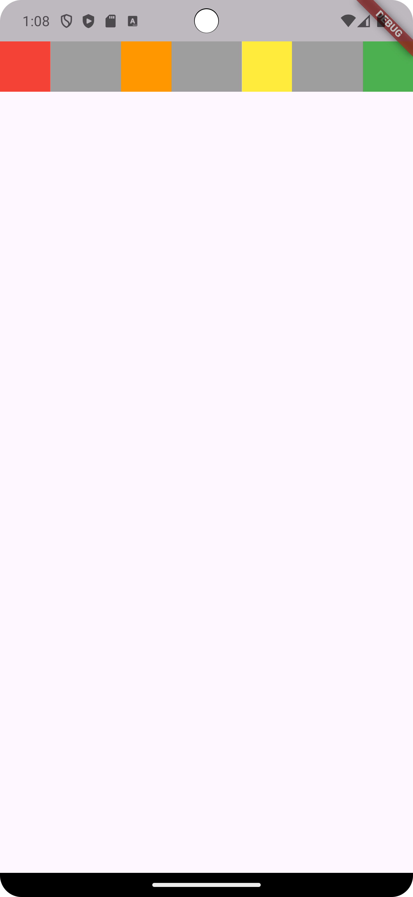
    <figcaption>MainAxisAlignment.spaceBetween</figcaption>
  </figure>
  <figure style="flex: 1; padding: 5px; margin: 0; text-align: center;">
    
    <figcaption>MainAxisAlignment.spaceAround</figcaption>
  </figure>
  <figure style="flex: 1; padding: 5px; margin: 0; text-align: center;">
    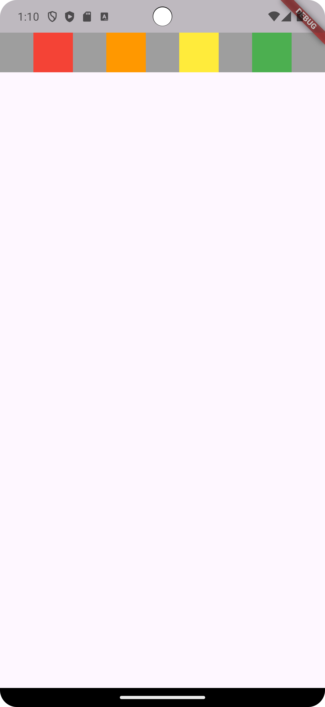
    <figcaption>MainAxisAlignment.spaceEvenly</figcaption>
  </figure>
</div>

<br/>

## MainAxisSize
- 주축의 크기 조절

**Column**
```dart
return Scaffold(
	body: SafeArea(
	  child: Container(
	    color: Colors.grey,
	    child: Column(
	      mainAxisAlignment: MainAxisAlignment.start,
	      mainAxisSize: [MainAxisSize.max | MainAxisSize.min],
	      // ...
```
<div style="display: flex; width: 60%; justify-content: space-between;">
  <figure style="flex: 1; padding: 5px; margin: 0; text-align: center;">
    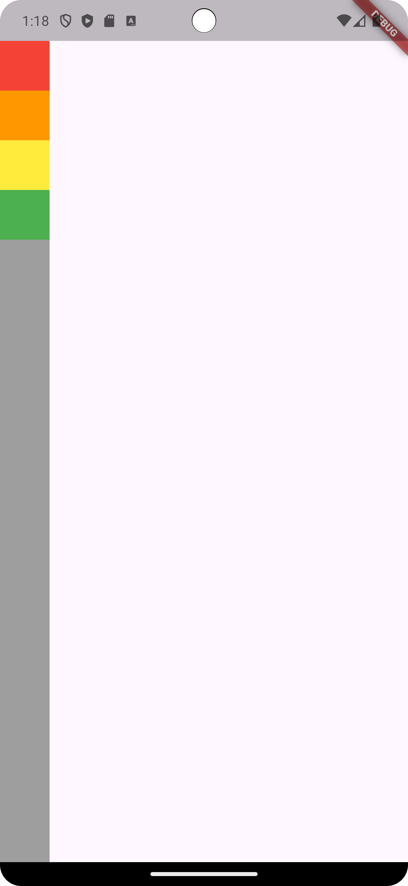
    <figcaption>MainAxisSize.max(기본값)</figcaption>
  </figure>
  <figure style="flex: 1; padding: 5px; margin: 0; text-align: center;">
    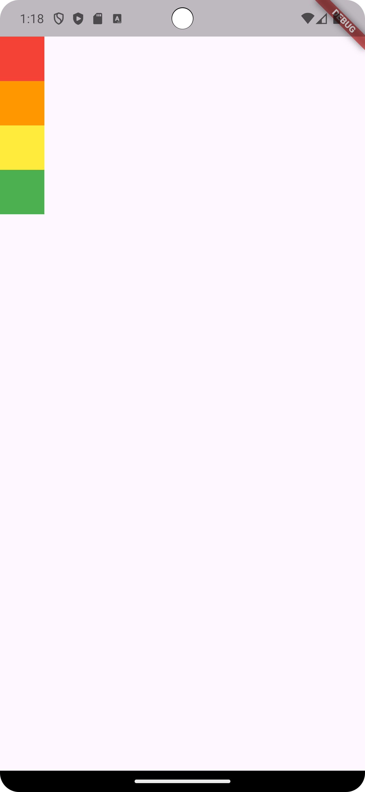
    <figcaption>MainAxisSize.min</figcaption>
  </figure>
</div>

<br/>

**Row**
```dart
return Scaffold(
	body: SafeArea(
	  child: Container(
	    color: Colors.grey,
	    child: Row(
	      mainAxisAlignment: MainAxisAlignment.start,
	      mainAxisSize: [MainAxisSize.max | MainAxisSize.min],
	      // ...
```
<div style="display: flex; width: 60%; justify-content: space-between;">
  <figure style="flex: 1; padding: 5px; margin: 0; text-align: center;">
    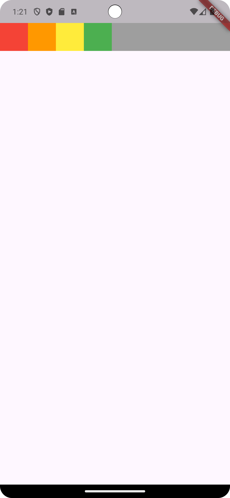
    <figcaption>MainAxisSize.max(기본값)</figcaption>
  </figure>
  <figure style="flex: 1; padding: 5px; margin: 0; text-align: center;">
    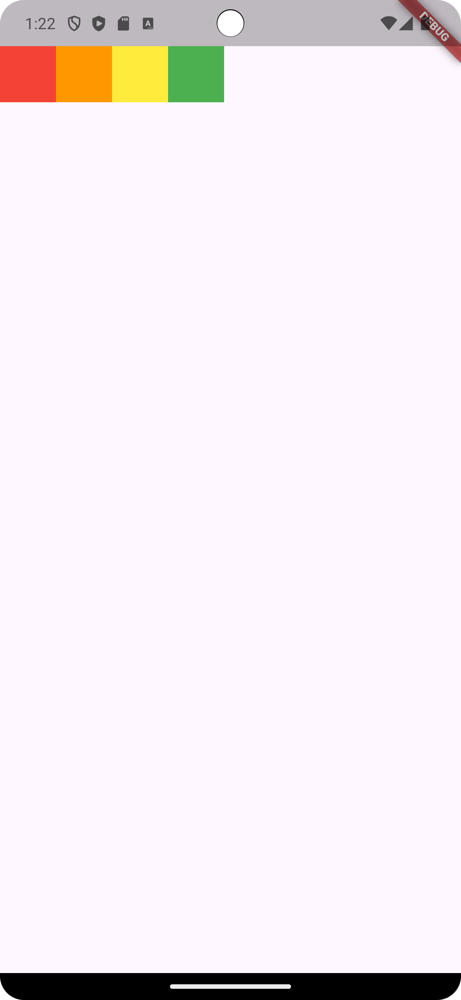
    <figcaption>MainAxisSize.min</figcaption>
  </figure>
</div>


<br/><br/>

## CrossAxisAlignment
- 교차축 (Row : 세로 / Column : 가로)
- 제한 사항이 없다면 최소 크기를 차지

|옵션|설명|
|---|---|
| `CrossAxisAlignment.start` | 교차축의 시작에 정렬한다. |
| `CrossAxisAlignment.end` | 교차축의 끝에 정렬한다. |
| `CrossAxisAlignment.center` | 교차축의 중앙에 정렬한다. (기본값) |
| `CrossAxisAlignment.stretch` | 교차축으로 위젯들을 최대로 확장한다. |
| `CrossAxisAlignment.baseline` | 텍스트 기준선을 기준으로 위젯을 정렬한다. |


<br/>

**Column**
```dart
return Scaffold(
  body: SafeArea(
    child: Container(
      color: Colors.grey,
      width: double.infinity, // 최대너비
      child: Column(
        mainAxisAlignment: MainAxisAlignment.start,
        mainAxisSize: MainAxisSize.max,
        crossAxisAlignment: CrossAxisAlignment.center,
        // ...
```


<div style="display: flex; width: 100%; justify-content: space-between;">
  <figure style="flex: 1; padding: 5px; margin: 0; text-align: center;">
    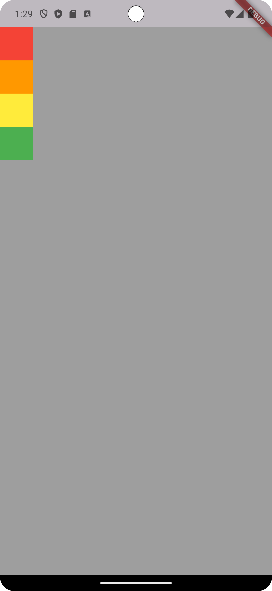
    <figcaption>CrossAxisAlignmet.start</figcaption>
  </figure>
  <figure style="flex: 1; padding: 5px; margin: 0; text-align: center;">
    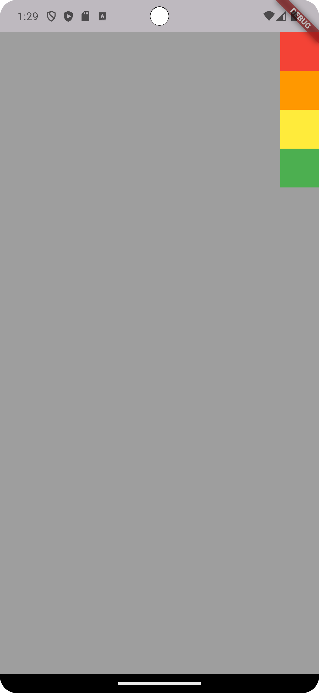
    <figcaption>CrossAxisAlignmet.end</figcaption>
  </figure>
  <figure style="flex: 1; padding: 5px; margin: 0; text-align: center;">
    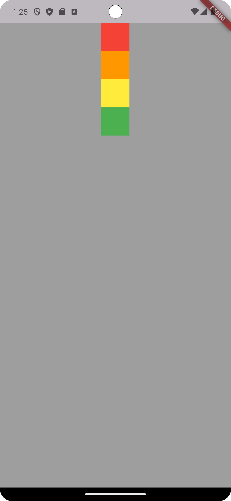
    <figcaption>CrossAxisAlignmet.center(기본값)</figcaption>
  </figure>
  <figure style="flex: 1; padding: 5px; margin: 0; text-align: center;">
    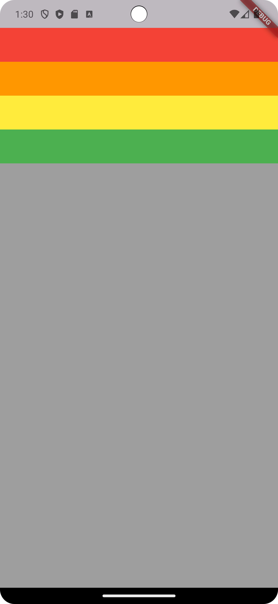
    <figcaption>CrossAxisAlignmet.stretch</figcaption>
  </figure>
</div>


<br/>

**Row**
```dart
return Scaffold(
  body: SafeArea(
    child: Container(
      color: Colors.grey,
      height: double.infinity, // 최대높이
      child: Row(
        mainAxisAlignment: MainAxisAlignment.start,
        mainAxisSize: MainAxisSize.max,
        crossAxisAlignment: CrossAxisAlignment.center,
        // ...
```
<div style="display: flex; width: 100%; justify-content: space-between;">
  <figure style="flex: 1; padding: 5px; margin: 0; text-align: center;">
    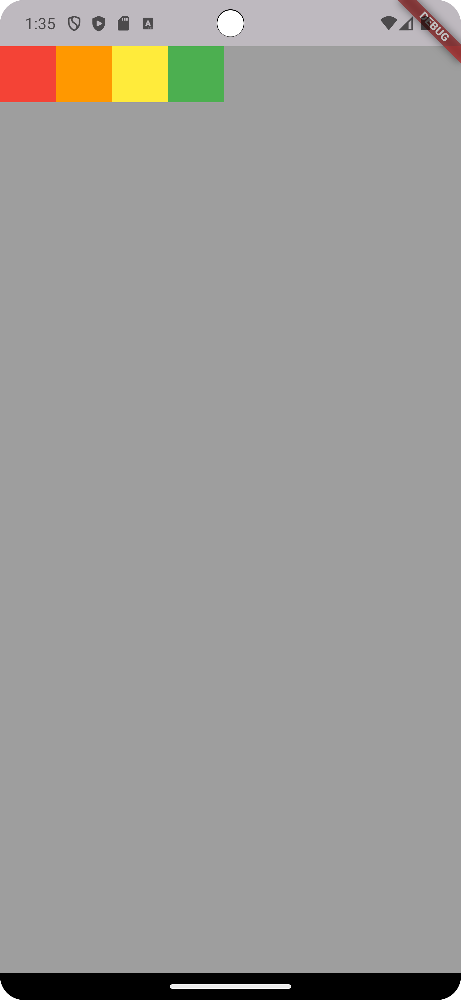
    <figcaption>CrossAxisAlignmet.start</figcaption>
  </figure>
  <figure style="flex: 1; padding: 5px; margin: 0; text-align: center;">
    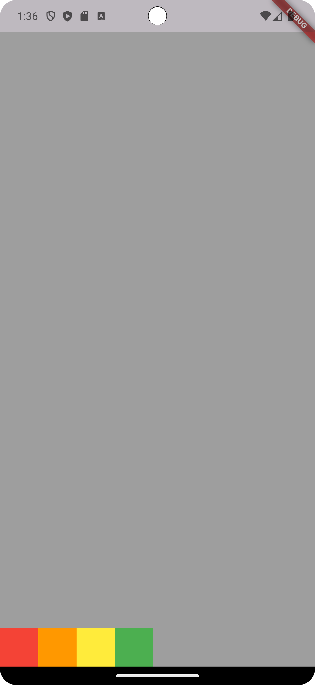
    <figcaption>CrossAxisAlignmet.end</figcaption>
  </figure>
  <figure style="flex: 1; padding: 5px; margin: 0; text-align: center;">
    
    <figcaption>CrossAxisAlignmet.center(기본값)</figcaption>
  </figure>
  <figure style="flex: 1; padding: 5px; margin: 0; text-align: center;">
    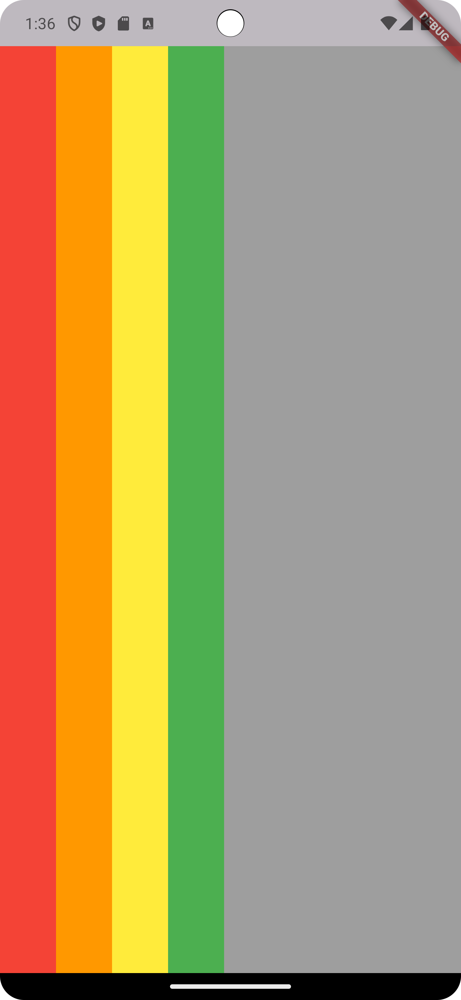
    <figcaption>CrossAxisAlignmet.stretch</figcaption>
  </figure>
</div>

<br/>

> **📌 CrossAxisAlignment.baseline**
> CrossAxisAlignment.baseline을 적용하게 되면 TextBaseline을 추가로 입력해줘야한다.
>
> - `TextBaseline.alphabetic` : 글자의 끝머리는 포함하지 않은 채로 글자를 정렬
> - `TextBaseline.ideographic` : 글자의 끝머리를 포함한 채로 글자를 정렬

<br/>

## Expanded Widget
- Row나 Column 안에서 다른 자식 위젯들이 공간을 차지하고 남은 영역을 혼자 또는 다른 Expanded Widget들과 나누어 차지하는 위젯.
- 이 때 Expanded Widget의 내부 위젯의 크기는 최대 사이즈를 차지한다.
- Expended Widget을 여러 개 사용할 경우 남는 공간을 ExpendedWiget들끼리 똑같은 비율로 차지하게 된다.
- ExpendedWidget들끼리 비율의 기본값은 1 : 1 이지만 flex 파라미터를 사용하면 비율을 다르게 할 수 있다.

<div style="display: flex; width: 80%; justify-content: space-between;">
  <figure style="flex: 1; padding: 5px; margin: 0; text-align: center;">
    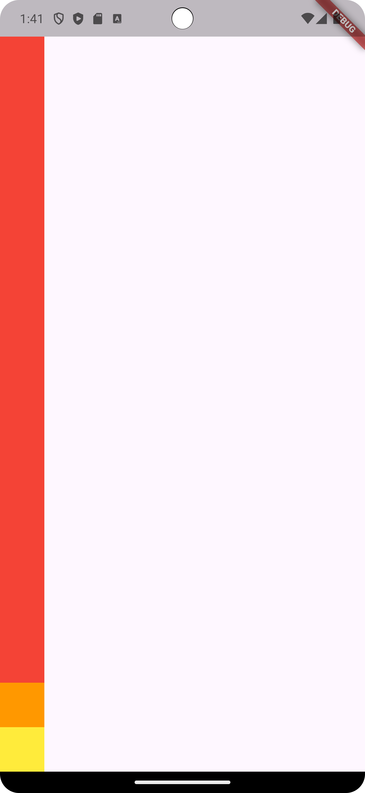
    <figcaption>하나의 ExpandedWidget을 사용한 경우</figcaption>
  </figure>
  <figure style="flex: 1; padding: 5px; margin: 0; text-align: center;">
    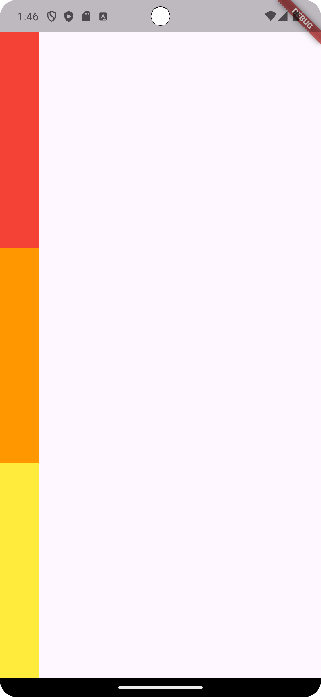
    <figcaption>여러개의 ExpandedWidget을 사용한 경우(1:1:1)</figcaption>
  </figure>
  <figure style="flex: 1; padding: 5px; margin: 0; text-align: center;">
    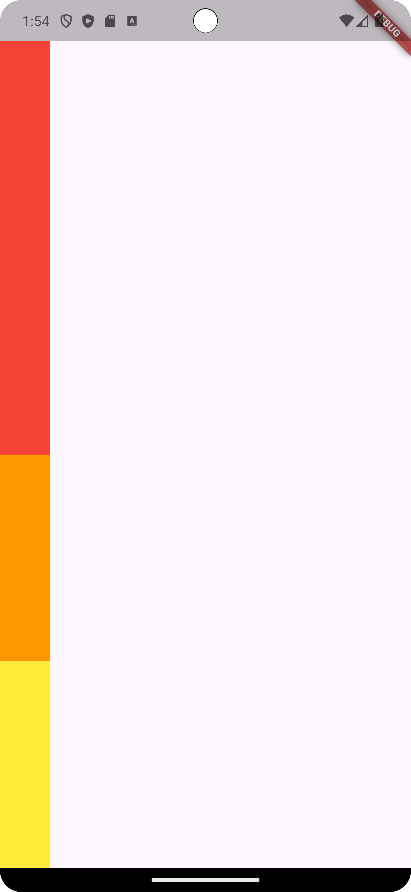
    <figcaption>여러개의 ExpandedWidget을 사용한 경우(2:1:1)</figcaption>
  </figure>
</div>

<br/>

## Flexible Widget
- Expaned Widget의 상위 클래스.
- Row나 Column 안에서 다른 자식 위젯들이 공간을 차지하고 남은 영역을 혼자 또는 다른 Flexible Widget (하위클래스 포함)과 차지하는 위젯
- 그러나 Flexible Widet의 내부 위젯은 기본적으로 필요로하는 만큼의 최소 공간만 차지한다.
- `fit` 파라미터를 조절하여 Flexible Widget이 실제로 차지하는 크기만큼 내부 위젯(자식 위젯)이 차지하도록 할 수 있는지 결정한다.
  - `Flexfit.loose`(기본값) : Flexible Widget의 내부 위젯은 배정된 크기만 차지한다.
  - `Flexfit.tight` : Expended Widget과 같음

<div style="display: flex; width: 60%; justify-content: space-between;">
  <figure style="flex: 1; padding: 5px; margin: 0; text-align: center;">
    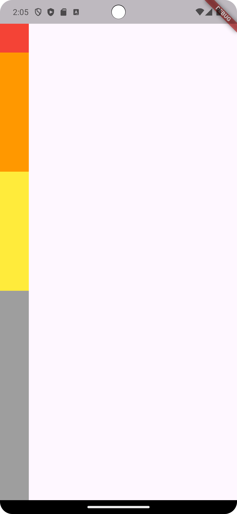
    <figcaption>Flexfit.loose <br/> (회색공간은 FlexibleWidget이 차지하고 있어서 다른 Widget들이 침범하지 못한다.)</figcaption>
  </figure>
  <figure style="flex: 1; padding: 5px; margin: 0; text-align: center;">
    
    <figcaption>Flexfit.tight</figcaption>
  </figure>
</div>